# Predicting the Geomagnetic Dst Index from Solar-Wind Conditions

**A technical report on regression and storm-event classification using the DrivenData *MagNet* dataset.**

---

## Abstract

We predict the geomagnetic disturbance-storm-time (**Dst**) index from in-situ
solar-wind measurements, and reframe the problem as a rare-event classifier for
moderate-or-stronger geomagnetic storms (`Dst ≤ -50 nT`). Working from ~8.4M
minute-cadence solar-wind records aggregated to **139,872 hourly samples**, we
train and compare Random Forest, XGBoost, Logistic Regression, and (linear and
RBF) Support Vector Machines, evaluated with confusion matrices, ROC and
precision–recall curves, calibration diagrams, and lift/cumulative-gains charts.

The analysis proceeded in two phases. An **initial study (§1–§4)** used a random
train/test split and reported R² ≈ 0.44 and Average Precision ≈ 0.48. We then
found that random splitting **leaks information** between the autocorrelated,
near-duplicate adjacent hours, and **corrected the evaluation (§5)** with
time-aware splits (period-holdout and forward-chaining). Under the honest split
the base-feature numbers fall to **R² ≈ 0.37 / AP ≈ 0.44** (forward-chaining) or
as low as **R² ≈ 0.25 / AP ≈ 0.30** (unseen period) — the random-split figures
were optimistic by 0.07–0.19 R². We then recovered and far exceeded the original
performance by engineering **temporal features** (rolling stats, lags, gradients,
integrated southward Bz), reaching **R² ≈ 0.67 / AP ≈ 0.71** on the
forward-chaining split and — on the strictest **unseen-epoch (period-holdout)**
test, the honest ceiling — **R² ≈ 0.59 / AP ≈ 0.63**. Sunspot number and L1
propagation delay add a small further gain, and a two-stage storm-specialist
model cuts severe-storm (`Dst ≤ -100`) error by ~14%. A decision experiment found
that **partitioning by solar-wind regime gives no benefit** over a single
temporal model, so it was not pursued. **Net result: temporal feature engineering
is the dominant accuracy lever**, and honest time-aware validation is essential to
measure it.

---

## 1. Introduction

### 1.1 Background

Geomagnetic storms are disturbances of Earth's magnetosphere driven by solar-wind
energy input, principally through magnetic reconnection when the interplanetary
magnetic field (IMF) turns **southward**. They can disrupt satellites, GPS/GNSS
positioning, HF radio, and — in severe cases — ground power grids. The
**Dst index** quantifies storm intensity from the depression of the horizontal
geomagnetic field measured by low-latitude magnetometers; it is expressed in
nanotesla (nT), where **more negative means a stronger storm**. Quiet conditions
sit near 0 nT; intense storms reach below -100 nT.

### 1.2 Problem statement

Given hourly-averaged solar-wind parameters upstream of Earth, we want to (a)
**estimate the Dst value** (a regression problem), and (b) **flag storm events**
in a form suitable for an alerting system (a classification problem). The two
framings answer different questions: regression gives a continuous severity
estimate, while classification with a tunable threshold supports
recall-oriented early warning.

### 1.3 Storm definition

We adopt the common operational cut **`Dst ≤ -50 nT`** as the positive
("storm") class — i.e. moderate (≈NOAA G2) or stronger activity. This event is
**rare (3.3% of hours)**, which makes class imbalance a central concern and
motivates the metric choices in §3.5.

---

## 2. Data

### 2.1 Sources

The data come from the DrivenData **MagNet: Model the Geomagnetic Field**
challenge:

| File | Contents | Scale |
|---|---|---|
| `solar_wind.csv` | Minute-cadence solar-wind / IMF measurements | ~8.4M rows |
| `labels.csv` | Hourly Dst index | hourly |
| `satellite_pos.csv` | ACE/DSCOVR spacecraft positions | hourly (unused) |
| `sunspots.csv` | Monthly smoothed sunspot number | monthly (unused) |

Records are split into three independent observation periods (`train_a`,
`train_b`, `train_c`). Crucially, the `timedelta` column **restarts at zero for
each period**, so it is an offset *within* a period, not a global timestamp.

### 2.2 Features

Five physically-motivated solar-wind drivers are used as model inputs:

| Feature | Meaning | Why it matters |
|---|---|---|
| `speed` | Solar-wind bulk speed (km/s) | Faster wind delivers more energy / stronger shocks |
| `bt` | Total IMF magnitude (nT) | Sets the ceiling on the reconnection electric field |
| `bz_gsm` | North–south IMF component (nT) | **Southward (negative) Bz** is the primary storm driver |
| `density` | Proton number density (p/cm³) | Controls dynamic pressure on the magnetosphere |
| `temperature` | Proton temperature (K) | Discriminates wind regimes (e.g. CME ejecta) |

The target is `dst` (nT).

---

## 3. Methodology

### 3.1 Preprocessing pipeline (`prepare_data.py`)

1. **Load** `solar_wind.csv`, keeping only the five features plus the
   `(period, timedelta)` keys to bound memory on the ~916 MB file.
2. **Floor `timedelta` to the hour** to align with the hourly Dst target.
3. **Coerce** feature columns to numeric (`errors="coerce"`), turning malformed
   entries into `NaN`.
4. **Aggregate to hourly means grouped by `(period, timedelta)`.** This is the
   single most important data decision: grouping by `timedelta` *alone* — as an
   earlier version did — silently averages the three independent periods
   together, collapsing the dataset and contaminating the signal. Grouping by
   `(period, timedelta)` preserves all three series and yields **139,872** hourly
   rows. `mean()` skips `NaN`, so partial gaps within an hour are tolerated.
5. **Join** the hourly features to Dst on `(period, timedelta)` (labels
   de-duplicated, kept first). 100% of feature rows receive a label.

### 3.2 Train / validation / test protocol

A single stratified three-way split is used throughout so that tuning and
threshold selection never see the test data:

| Split | Share | Purpose |
|---|---|---|
| Train | 64% (87,370) | Fit models; cross-validate hyperparameters |
| Validation | 16% (21,843) | Select decision thresholds; fit calibration |
| Test | 20% (27,304) | Report all final metrics |

Stratification preserves the 3.3% storm rate across splits.

### 3.3 Models

- **Random Forest** (`n_estimators=200`) — non-linear, scale-invariant baseline.
- **XGBoost** — gradient-boosted trees; tuned by grid search (§4.5) with
  `scale_pos_weight = n_neg/n_pos ≈ 29` to counter imbalance.
- **Logistic Regression** — linear, interpretable baseline.
- **Linear SVM** (`LinearSVC`) and **RBF SVM** (`SVC`) — margin classifiers.

Logistic Regression and the SVMs are **scale-sensitive**, so they are wrapped in
a `StandardScaler` pipeline (features span `bz ≈ -10` to `temperature ≈ 10⁵`).
Tree models need no scaling. Because a kernel SVM is **O(n²)** in samples, the
RBF SVM is tuned/trained on a stratified subsample (12–15k rows) but **evaluated
on the full test set** like every other model.

### 3.4 Handling class imbalance

Three complementary techniques are examined:

- `class_weight='balanced'` (Logistic Regression, SVM) — reweights the loss so
  the rare class counts more, effectively shifting the decision boundary.
- `scale_pos_weight` (XGBoost) — the gradient-boosting analogue.
- **Threshold tuning** (§4.6) — choosing the probability cut-off to meet a target
  recall, decoupled from the model entirely.

### 3.5 Evaluation metrics

**Regression**

- **MAE** — mean absolute error (nT); robust, directly interpretable.
- **RMSE** — root-mean-square error (nT); penalises large misses.
- **R²** — fraction of Dst variance explained.

**Classification.** With a 3.3% positive rate, accuracy is misleading (predicting
"never a storm" scores 96.7%), so we emphasise:

- **Confusion matrix** — TP/FP/FN/TN at a chosen threshold.
- **Precision** = TP/(TP+FP); **Recall** = TP/(TP+FN); **FPR** = FP/(FP+TN);
  **F1** = harmonic mean of precision and recall.
- **ROC curve / AUC** — TPR vs FPR across thresholds; threshold-independent
  ranking quality (0.5 = random).
- **Precision–Recall curve / Average Precision (AP)** — more informative than ROC
  under heavy imbalance because it ignores the abundant true negatives; the
  random baseline equals the positive base rate (0.033).
- **Calibration (reliability) diagram + Brier score** — whether a predicted "p%"
  actually occurs p% of the time; the Brier score is the mean squared error of
  the probabilities (lower is better).
- **Lift & cumulative gains** — operational ranking value: what fraction of all
  storms is captured by targeting the top-x% highest-risk hours, versus random.

---

## 4. Experiments and Results (initial analysis — random split)

> ⚠️ **The numbers in §4 use a random train/test split and are
> leakage-optimistic.** They are retained to document the model comparison and
> diagnostics, but the *honest* performance figures are in **[§5](#5-leakage-correction-and-time-aware-modeling)**.
> Treat §4 as relative model ranking, not absolute deployment performance.

All metrics below are on the held-out **test set** (27,304 hours, 3.31% storms).

### 4.1 Regression performance (deployed model)

The model served by `app.py` is a `RandomForestRegressor` over the five features.

| Metric | Value |
|---|---|
| MAE | 9.43 nT |
| RMSE | 14.12 nT |
| R² | 0.441 |

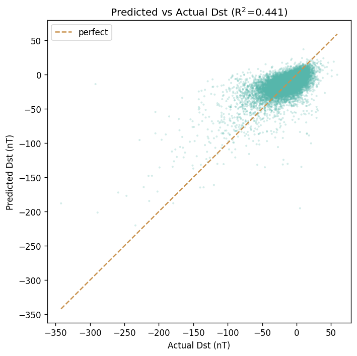
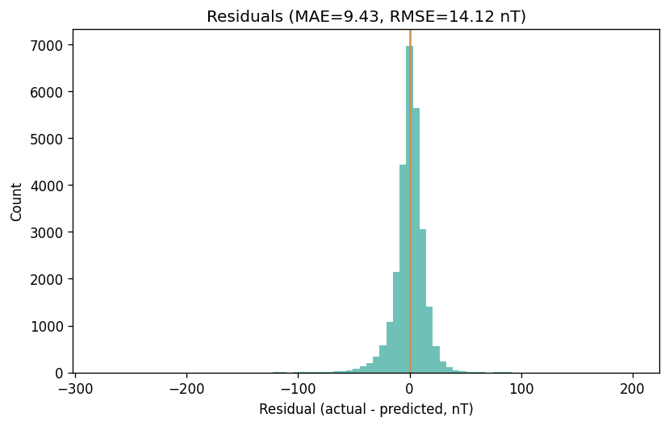

The predicted-vs-actual scatter is tight near quiet conditions but bends below
the diagonal at strongly negative Dst: the model **systematically under-predicts
the depth of large storms**, a regression-to-the-mean effect typical when extreme
events are scarce. Residuals are roughly centred but left-skewed for the same
reason.

### 4.2 Storm classifier — baseline

A single `RandomForestClassifier` on the storm event:

| Metric | Value | Random baseline |
|---|---|---|
| ROC AUC | 0.920 | 0.500 |
| Average Precision | 0.497 | 0.033 |

At the naïve 0.5 threshold it is **precise (0.785) but low-recall (0.253)** — it
only flags the most obvious storms, which is exactly the wrong behaviour for
early warning and the reason §4.6 retunes the threshold.

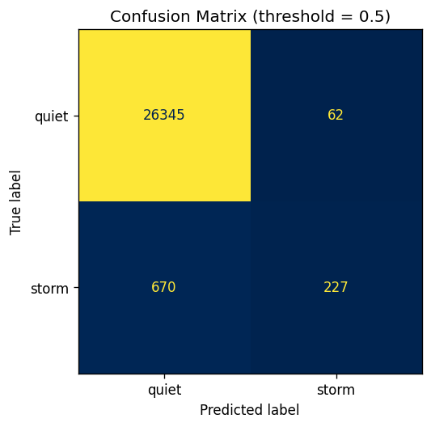
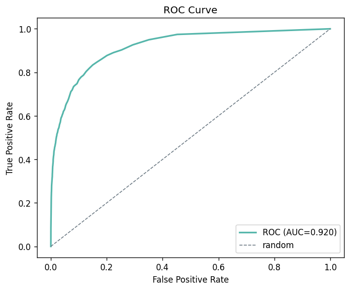
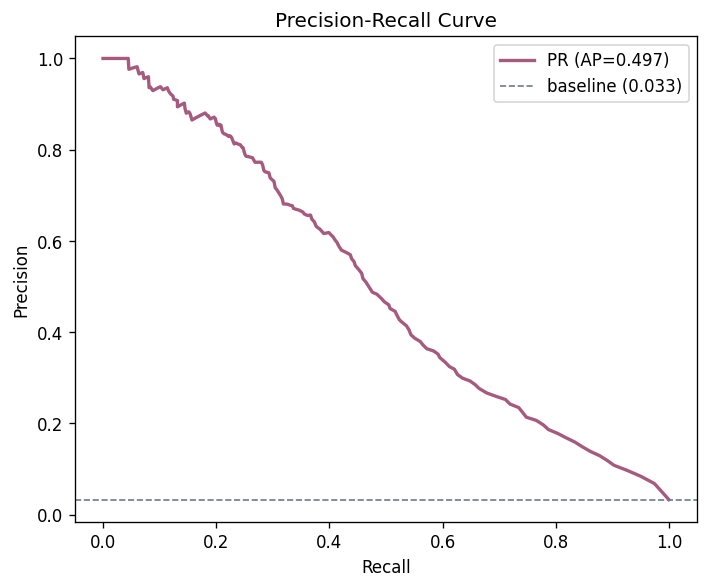
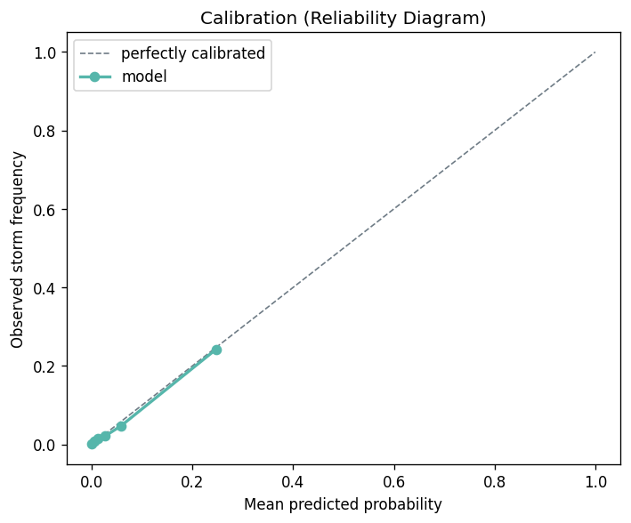
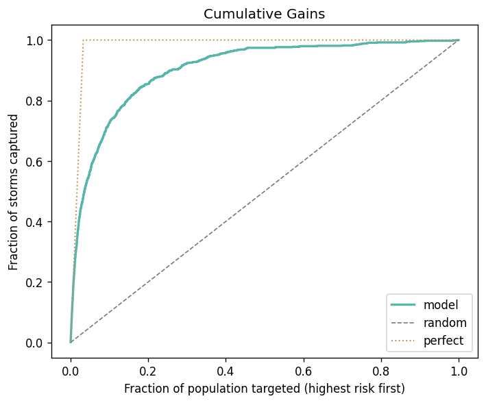
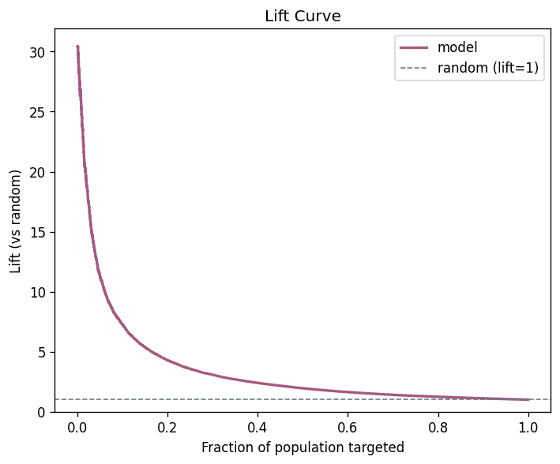

The gains/lift charts show strong ranking value: the **top 10%** highest-risk
hours contain **72.6%** of all storms (**7.3× lift**); the top 20% contain 85.5%
(4.3× lift).

### 4.3 Model comparison — out of the box

| Model | ROC AUC | Avg Precision | Precision@0.5 | Recall@0.5 | F1@0.5 |
|---|---|---|---|---|---|
| Logistic Regression | 0.888 | 0.335 | 0.622 | 0.169 | 0.266 |
| RBF SVM | 0.657 | 0.292 | 0.734 | 0.125 | 0.214 |
| **Random Forest** | **0.911** | **0.480** | 0.803 | 0.274 | 0.409 |

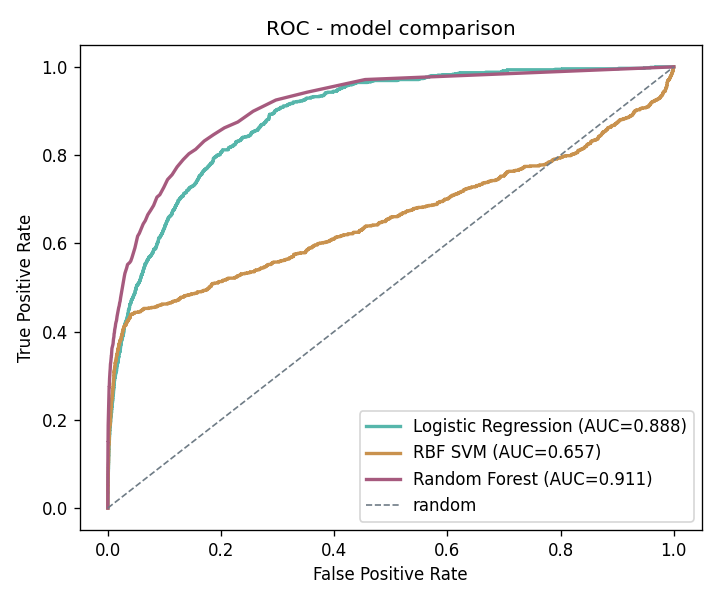
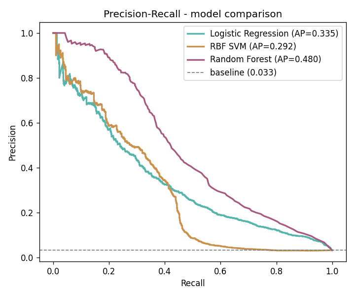
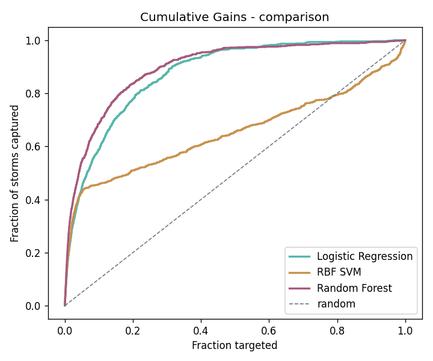
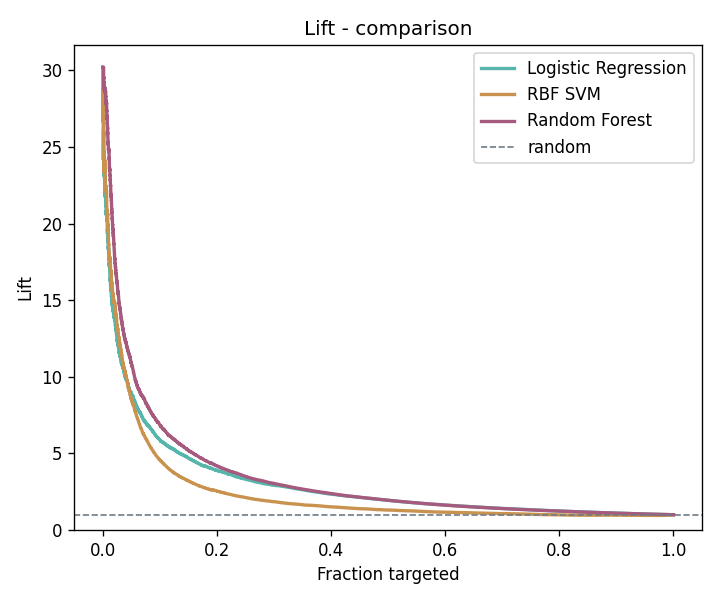

Random Forest leads on every metric. Logistic Regression is a respectable linear
baseline; the **untuned RBF SVM is both the weakest and the most expensive**.

### 4.4 Model comparison — tuned & class-balanced

`class_weight='balanced'` on the linear models, GridSearchCV on the RBF SVM
(best `C=10, gamma=0.1`), and XGBoost with `scale_pos_weight ≈ 29`.

| Model | ROC AUC | Avg Precision | Precision | Recall | F1 |
|---|---|---|---|---|---|
| LogReg (balanced) | 0.894 | 0.327 | 0.131 | 0.787 | 0.225 |
| Linear SVM (balanced) | 0.894 | 0.327 | 0.132 | 0.789 | 0.227 |
| RBF SVM (tuned) | 0.866 | 0.251 | 0.123 | 0.735 | 0.210 |
| **Random Forest** | **0.911** | **0.480** | 0.809 | 0.271 | 0.406 |
| XGBoost | 0.911 | 0.423 | 0.229 | 0.622 | 0.335 |

*(Precision/recall/F1 are at each model's native threshold, which shifts under
reweighting — compare the threshold-independent AUC and AP.)*

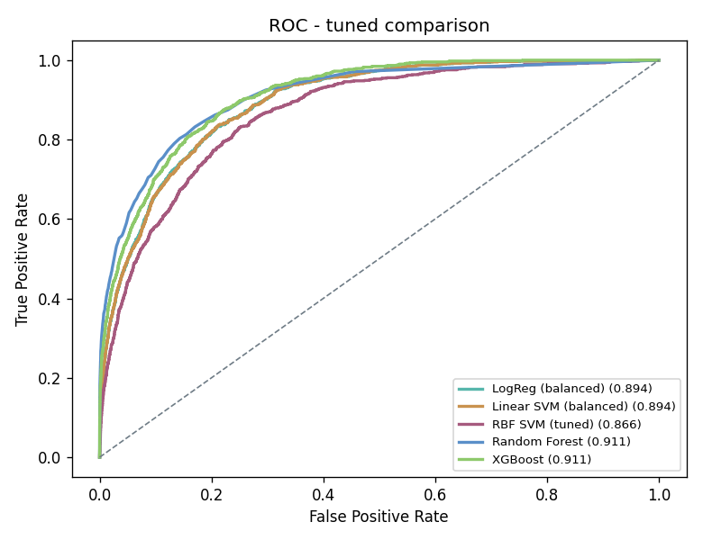
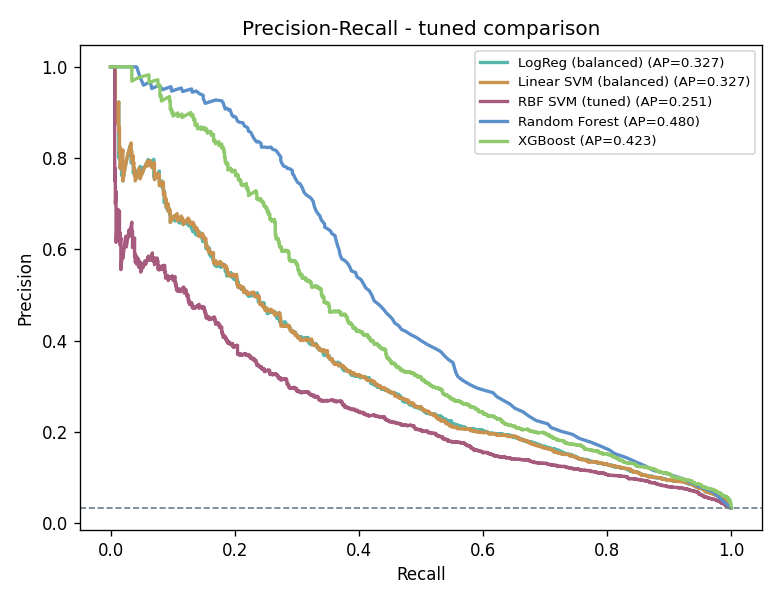
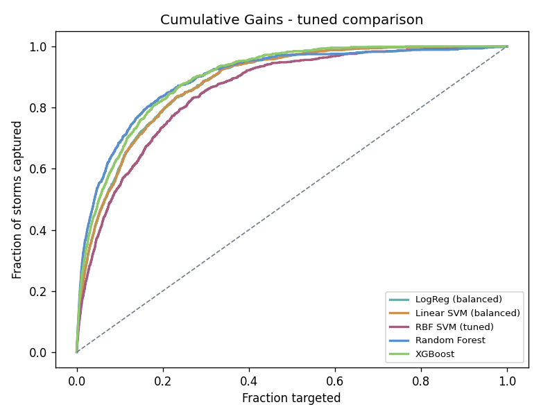

Key observations:

- **Tuning rescued the RBF SVM** (AUC 0.657 → 0.866) — the defaults were the
  problem — yet it still trails on AP and remains the costliest model.
- **Class balancing lifted linear-model recall** from ~0.17 to ~0.79 (trading
  away precision); it is the strongest single lever for hitting a recall target.
- Linear SVM and Logistic Regression are statistically indistinguishable (both
  linear boundaries).
- **Random Forest still leads on Average Precision.**

### 4.5 Final tuning — XGBoost vs Random Forest

Grid search over `max_depth ∈ {4,6,8}`, `n_estimators ∈ {300,600}`,
`learning_rate ∈ {0.05,0.1}`, `min_child_weight ∈ {1,5}` (3-fold CV, scored by
Average Precision). Best: `learning_rate=0.05, max_depth=8, min_child_weight=5,
n_estimators=300` (CV AP 0.442).

| Model | ROC AUC | Avg Precision |
|---|---|---|
| Random Forest | 0.9111 | **0.4800** |
| XGBoost (tuned) | **0.9153** | 0.4430 |

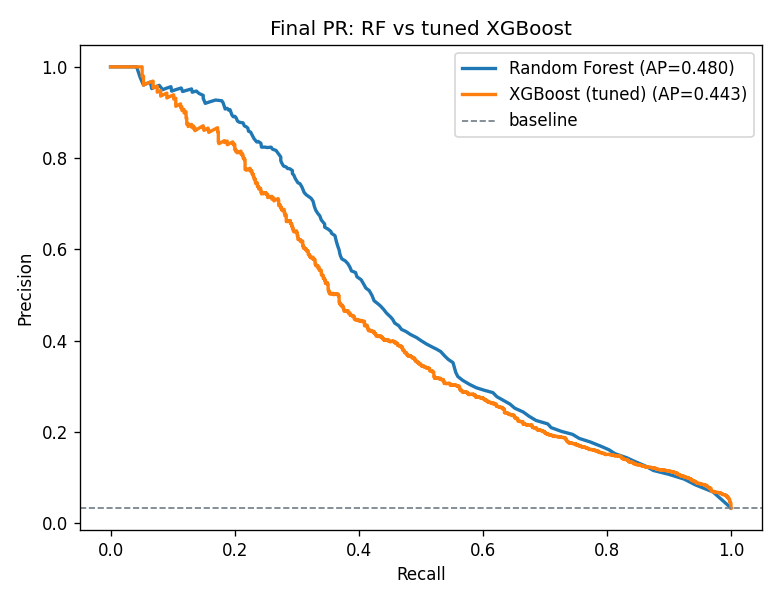

Tuned XGBoost edges ROC AUC but Random Forest retains the higher AP — so for this
imbalanced task the **Random Forest is the winner**, with XGBoost a near-tie
backup.

### 4.6 Operating thresholds

Thresholds are chosen on the **validation** set to meet a target recall, then
measured on **test** (27,304 hours):

| Target recall | Threshold | Precision | Recall | FPR | Caught / Missed | False alarms |
|---|---|---|---|---|---|---|
| 70% | 0.105 | 0.252 | 0.652 | 6.6% | 589 / 315 | 1,750 |
| **80%** | 0.060 | 0.178 | 0.773 | 12.2% | 699 / 205 | 3,232 |
| 90% | 0.020 | 0.107 | 0.899 | 25.7% | 813 / 91 | 6,778 |

Moving from 80% to 90% storm capture roughly **doubles false alarms** (3.2k →
6.8k) and flags a quarter of all quiet hours. The ~80% row is the usual
early-warning sweet spot. (The validation→test gap is visible — the "70%" point
realises 65% on test — and is expected when tuning a threshold on finite data.)

### 4.7 Probability calibration

| | Brier score |
|---|---|
| RF raw | 0.0228 |
| RF isotonic-calibrated | 0.0227 |

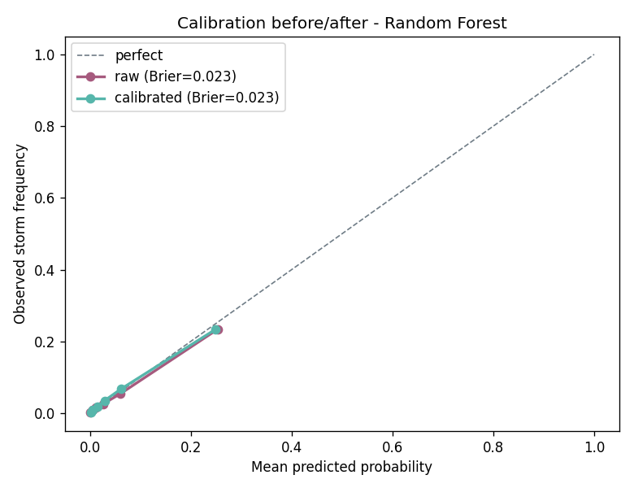

The Random Forest is **already well-calibrated**; isotonic regression (fit on
validation via a frozen estimator) yields no meaningful change, so the raw
predicted probabilities can be used directly in an alerting UI.

---

## 5. Leakage correction and time-aware modeling

This phase fixes the evaluation, then pushes accuracy with feature engineering.
All splits here are **time-aware**, computed per period:

- **Period-holdout** — train on two periods, test on the third (rotate all three).
  Periods are independent, so this has *zero* autocorrelation leakage; it measures
  generalisation to an entirely unseen epoch (and solar-cycle phase).
- **Forward-chaining** — first 80% of each period's timeline → train, last 20% →
  test. The most deployment-realistic setup (predict the future from the past).

### 5.1 The leakage (Step 1)

Same base-feature Random Forest, three splits (`eval_splits.py`):

| Split | R² | MAE | RMSE | ROC AUC | AP |
|---|---|---|---|---|---|
| **random (leaky, = §4)** | 0.442 | 9.46 | 14.31 | 0.917 | 0.484 |
| forward-chaining | 0.369 | 9.01 | 14.75 | 0.908 | 0.435 |
| period-holdout: test `train_a` | 0.264 | 14.83 | 22.37 | 0.824 | 0.376 |
| period-holdout: test `train_b` | 0.220 | 10.19 | 14.52 | 0.837 | 0.159 |
| period-holdout: test `train_c` | 0.269 | 9.62 | 14.11 | 0.905 | 0.374 |
| **period-holdout: mean** | **0.251** | 11.55 | 17.00 | 0.855 | **0.303** |

**Finding.** Random splitting overstated R² by **0.07** (vs forward-chaining) to
**0.19** (vs period-holdout) and AP by **0.05–0.18**. The honest numbers are
lower; the large per-period variance (AP 0.16–0.38) shows generalisation to an
unseen epoch is genuinely hard and the random split hid it entirely. **The
time-aware numbers are the real ones.**

### 5.2 Temporal features (Step 2)

Dst responds to the *recent history* of the solar wind, not just the current
hour. Within each period (never crossing boundaries) we engineered, per base
feature: rolling mean & std over 3/6/12/24 h, lags at 1/3/6 h, gradients over
1/3 h, plus integrated southward Bz over 6/12/24 h — **73 features** total
(`prepare_features.py`). Evaluated on the **forward-chaining** split:

| Features | Model | R² | MAE | ROC AUC | AP |
|---|---|---|---|---|---|
| base (5) | RandomForest | 0.371 | 8.99 | 0.917 | 0.442 |
| base (5) | XGBoost | 0.379 | 8.71 | 0.912 | 0.410 |
| **base+temporal (73)** | RandomForest | 0.655 | 6.84 | 0.968 | 0.705 |
| **base+temporal (73)** | XGBoost | 0.673 | 6.67 | 0.980 | 0.682 |

**Finding.** Temporal features are the single biggest lever: **R² nearly doubled**
(0.37 → 0.66) and **AP rose ~60%** (0.44 → 0.70) on the honest split — comfortably
beating even the leaky base-feature numbers from §4. This is consistent with
published Dst forecasting practice.

### 5.3 Auxiliary inputs (Step 4)

Adding the previously-unused `smoothed_ssn` (solar-cycle phase) and an L1→Earth
`prop_delay_min` (from ACE position and wind speed) → **76 features**:

| Features | Model | R² | ROC AUC | AP |
|---|---|---|---|---|
| base+temporal (73) | XGBoost | 0.673 | 0.980 | 0.682 |
| **base+temporal+aux (76)** | XGBoost | 0.666 | **0.981** | **0.712** |
| base+temporal+aux (76) | RandomForest | 0.664 | 0.968 | 0.714 |

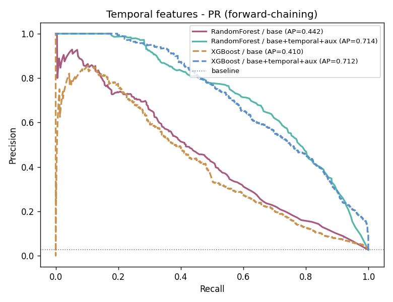

**Finding.** Auxiliary inputs give a small-but-real lift (XGBoost AP 0.682 → 0.712);
R² is flat. Low effort, modest gain — as expected.

### 5.4 The extreme-storm tail (Step 3)

The regressor compresses severe storms toward the mean. On the forward-chaining
split with full features (XGBoost; 161 severe `Dst ≤ -100` test hours), three
remedies (`eval_tail.py`):

| Method | R² | MAE (all) | MAE (Dst≤−50) | MAE (Dst≤−100) | Bias (Dst≤−100) |
|---|---|---|---|---|---|
| baseline | 0.666 | 6.90 | 28.16 | 57.31 | +57.2 |
| sample-weighted | 0.657 | 7.03 | 27.99 | 56.85 | +56.3 |
| **two-stage** | 0.662 | 6.99 | **25.49** | **49.43** | +48.5 |

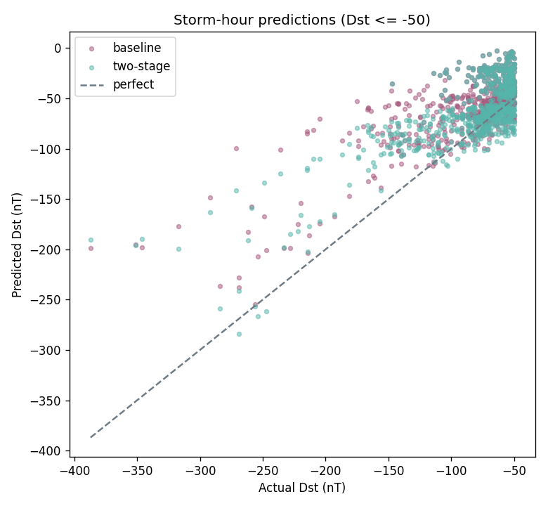

**Finding.** A two-stage model (storm/quiet classifier gating a storm-specialist
regressor) cuts severe-storm MAE by **~14%** (57.3 → 49.4 nT) at no cost to
overall R². Sample weighting barely helped. The positive **bias of ~+48 nT**
remaining on severe storms is the honest headline: even the best model still
under-predicts the depth of the most damaging events, and the tail is the open
problem.

### 5.5 Honest ceiling — temporal model on period-holdout

All temporal headlines above use forward-chaining. The strictest test is
**period-holdout** (train on two periods, test on the entirely unseen third), run
once on the full 76-feature XGBoost (`eval_regime.py`, baseline row):

| Fold (test) | R² | MAE | AUC | AP |
|---|---|---|---|---|
| `train_a` | 0.486 | 13.04 | 0.912 | 0.571 |
| `train_b` | 0.643 | 7.40 | 0.980 | 0.653 |
| `train_c` | 0.626 | 6.97 | 0.978 | 0.670 |
| **mean** | **0.585** | 9.14 | **0.957** | **0.631** |

**Finding.** Generalising to a wholly unseen epoch, the temporal model holds at
**R² ≈ 0.59 / AP ≈ 0.63 / AUC ≈ 0.96** — below the forward-chaining figures (R²
0.67 / AP 0.71) but *far* above the base-feature period-holdout ceiling (R² 0.25 /
AP 0.30, §5.1). Temporal features improve unseen-epoch generalisation, not just
within-period accuracy. **This is the number the headline rests on.** Fold spread
(AP 0.57–0.67) reflects the three periods' differing storm rates and solar-cycle
phases.

### 5.6 Decision experiment — regime as feature vs partition

Does the solar-wind regime help more as an input or as a way to split the model?
A heuristic regime label (quiet / CIR high-speed-stream / CME ejecta) was derived
from speed, density, and the temperature deficit relative to the speed-expected
value (an ICME signature) — 105k quiet, 28k CIR, 6k CME hours. Three variants on
period-holdout:

| Model | AP | severe MAE | R² |
|---|---|---|---|
| baseline (no regime) | **0.631** | **41.88** | 0.585 |
| A — regime as feature | 0.630 | 41.96 | 0.584 |
| B — regime as partition | 0.619 | 43.56 | 0.579 |

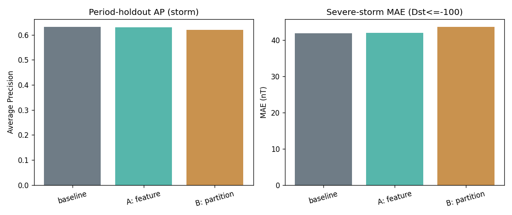

**Finding — partitioning dropped.** Regime-as-feature (A) is statistically
identical to baseline — the regime signal is already implicit in the temporal
features. Regime-as-partition (B) is *worse* on both AP and severe MAE, because
splitting the data starves each specialist of the already-rare storm examples.
**Neither beats the single model, so the ensemble was not built** — the question
is answered cheaply rather than on faith.

---

## 6. Discussion

- **Trees beat linear and kernel methods here.** Storm onset depends on
  *interactions* (e.g. high speed **and** strongly southward Bz); ensembles
  capture these naturally, while a linear boundary cannot, and an RBF SVM only
  approaches them at high tuning and compute cost.
- **ROC flatters; AP is the honest score.** Several models post ROC AUC ≈ 0.89–0.92
  yet differ markedly in AP (0.25–0.48). At 3.3% prevalence, AP and the PR curve
  are the metrics that reflect real decision quality.
- **The threshold dominates operations.** Algorithm choice moved AP by ~0.05;
  moving the threshold moves recall from 25% to 90%. Picking the operating point
  to a stated risk tolerance matters more than squeezing the last point of AUC.
- **Calibration is essentially free** with the Random Forest, which is convenient
  for surfacing trustworthy "storm probability" numbers to users.
- **Validation design dominated everything.** The single largest "result" was
  discovering that the random split leaked (§5.1): it inflated R² by up to 0.19.
  No model change in §4 mattered as much as fixing the protocol.
- **Temporal context is where the signal is.** On the honest split, adding recent
  solar-wind history (§5.2) roughly doubled R² and AP — far more than any
  algorithm swap. Geomagnetic response is intrinsically dynamical.
- **More structure isn't automatically better.** Regime labels — whether added as
  a feature or used to partition into specialists (§5.6) — gave no improvement;
  partitioning actively hurt by fragmenting the rare storm class. A negative result
  that saved building an ensemble.

---

## 7. Limitations

- **Extreme-storm underestimation persists.** Even the best (two-stage) model
  under-predicts severe `Dst ≤ -100` storms by ~48 nT on average (§5.4). The
  events that matter most remain the hardest, with few examples to learn from.
- **Three periods only.** Period-holdout has just three folds with very different
  base rates (2–7%), so unseen-epoch estimates carry wide uncertainty (§5.1).
- **No sequence model yet.** Temporal structure is captured via engineered
  windowed features, not a model that ingests the raw minute-cadence series.
- **SVM subsampling.** The RBF SVM is tuned on a subset for tractability, so its
  §4 numbers are a lower bound on a fully-trained kernel model.
- **Hourly aggregation.** Averaging to the hour discards sub-hourly structure
  (e.g. shock fronts) that may carry short-lead predictive information.

---

## 8. Future work

1. **Sequence models** — an LSTM or temporal CNN on the raw minute-cadence series
   is the natural next step now that engineered temporal features have proven the
   value of history. (Often matched by features-into-GBT, so treat as exploratory.)
2. **Push the tail further** — quantile regression, custom asymmetric losses, or a
   richer storm specialist to close the ~48 nT severe-storm bias.
3. **Probabilistic forecasts** — predict Dst distributions / quantiles, not point
   estimates, to express uncertainty during storms.
4. **Lead-time framing** — predict Dst *n* hours ahead (true forecasting) rather
   than nowcasting the current hour.
5. **Deploy** a calibrated storm-probability endpoint in the Flask app at the
   80%-recall operating point, alongside the Dst regression.

---

## 9. Conclusion

We built a Dst regressor and a storm-event classifier on a correctly
de-aggregated 139,872-row dataset, then **corrected an initial methodological
flaw**: a random train/test split leaked autocorrelated neighbours and overstated
performance (R² 0.44 → an honest 0.25–0.37; AP 0.48 → 0.30–0.44). On the honest
time-aware split, **temporal feature engineering was the decisive lever**, lifting
the model to **R² ≈ 0.67 / AP ≈ 0.71** (forward-chaining) and a defensible
**R² ≈ 0.59 / AP ≈ 0.63** on the strictest unseen-epoch test — well past the
original optimistic figures — with sunspot/propagation features adding a small
further gain and a two-stage model trimming severe-storm error by ~14%.
Partitioning by solar-wind regime was tested and rejected as offering no benefit.
Among algorithms, Random Forest and tuned XGBoost are co-leaders and
interchangeable in practice. The broader lessons: **honest validation must come
first, and for a dynamical system the recent past is worth more than a better
classifier.**

---

## References

- DrivenData, *MagNet: Model the Geomagnetic Field.*
- NOAA Space Weather Prediction Center, *Geomagnetic Storms (G-scale)* and the
  *Dst index* definition.

---

## Appendix A — Reproducibility

```bash
python3 -m venv .venv && source .venv/bin/activate
pip install -r requirements.txt

python prepare_data.py          # raw -> hourly_avg[_dst].csv
python train_model.py           # train + save the deployed regressor
python evaluate_model.py        # §4.1-4.2 regression + classification diagnostics
python compare_models.py        # §4.3 LogReg vs SVM vs Random Forest
python compare_models_tuned.py  # §4.4 tuning, class balancing, XGBoost
python tune_and_finalize.py     # §4.5-4.7 XGBoost tuning, thresholds, calibration

# Phase 2 - leakage correction & time-aware modeling (§5)
python prepare_features.py      # temporal + sunspot + propagation features
python eval_splits.py           # §5.1 random vs period-holdout vs forward-chaining
python eval_temporal.py         # §5.2-5.3 base vs temporal vs +aux (RF & XGBoost)
python eval_tail.py             # §5.4 extreme-storm tail remedies
python eval_regime.py           # §5.5-5.6 period-holdout ceiling + regime decision
```

## Appendix B — File map

| Script | Role |
|---|---|
| `prepare_data.py` | Build hourly dataset from raw solar wind + labels |
| `train_model.py` | Train and persist the deployed `RandomForestRegressor` |
| `evaluate_model.py` | Regression + single-model classification diagnostics |
| `compare_models.py` | Baseline model comparison |
| `compare_models_tuned.py` | Tuned, class-balanced comparison incl. XGBoost |
| `tune_and_finalize.py` | XGBoost grid search, threshold selection, calibration |
| `prepare_features.py` | Temporal + sunspot + propagation feature engineering |
| `eval_splits.py` | Leakage comparison across split strategies (§5.1) |
| `eval_temporal.py` | Base vs temporal vs auxiliary features (§5.2-5.3) |
| `eval_tail.py` | Extreme-storm tail remedies (§5.4) |
| `eval_regime.py` | Period-holdout ceiling + regime feature/partition decision (§5.5-5.6) |
| `app.py` | Flask app serving Dst predictions |

*Note: `temperature` (proton temperature, K) is named per the MagNet schema; the
physical descriptions above summarise standard space-weather interpretations of
each driver.*
